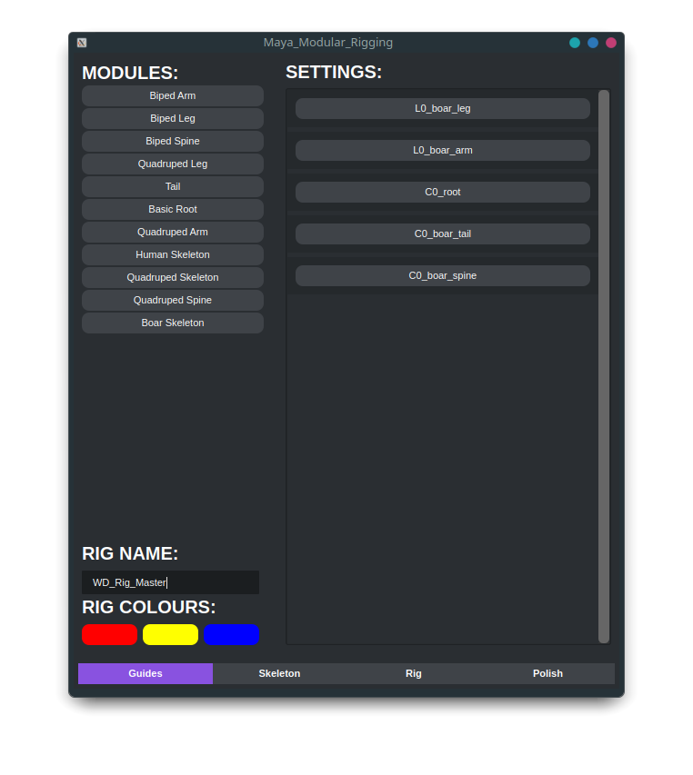

<h1 align="center">WD-Modular-Auto-Rigging</h1>
<p align="center">
    
    
    
    
</p>
<div align="center">
    
</div>

### Running The Tool

> [!WARNING]
> - All tools are designed to be either run through the Maya script editor or a shelf tool and can be ran with a similar code to the below.<br>
> - See each individual sub-folder for the specific run code.<br>
> - As I have switched to linux recently you might need to check the pathing if you are running a windows based machine.

```python
from maya_modular_rigging import main

main.run_ui()
```
### New Module Setup & Parameters

> [!IMPORTANT]
> New modules must be placed within their own .py file within [~/systems/modules](https://github.com/WillDyer/maya_modular_rigging/tree/main/systems/modules)

#### system: a list of the joint names used in module.

```python
system = ["joint_1","joint_2","joint_3"]
# This variable is REQUIRED
```
#### system_pos: a list of translations of each joint from system.
```python
system_pos = {"joint_1": [X, Y, Z],"joint_2": [X, Y, Z],"joint_3": [X, Y, Z]}
# This variable is REQUIRED
```
#### system_rot: a list of rotations of each joint from system.
```python
system_rot = {"joint_1": [X, Y, Z],"joint_2": [X, Y, Z],"joint_3": [X, Y, Z]}
# This variable is REQUIRED
```
#### available_rig_types: a list of rig types available for module. Options are below.
```python
available_rig_types = ["FK","IK","FKIK"]
# This variable is REQUIRED however can be one or more types.
```
#### ik_joints: which joints are needed for the ik handle
```python
ik_joints = {
    "start_joint": "joint_1",
    "end_joint": "joint_2",
    "pv_joint": "joint_3",
    "world_orientation": False
}
# This dictionary is only required if available_rig_types include IK or FKIK
```
#### side: which side of the rig.
```python
side = "_l"
# This variable is REQUIRED.
# Note: Currently only available on _l.
```
#### space_swapping: objects to be space swapped.
```python
space_swapping = ["joint_1","root","COG","Custom"]
# This list is REQUIRED is available_rig_types include IK or FKIK.
# Note: All object but custom must exist within the rig to work.
```
#### guide_scale: scale of guide curves.
```python
guide_scale = 1
# This variable is REQUIRED.
```
#### reverse_foot: if reverse foot is required.
```python
reverse_foot = True
# This variable is REQUIRED.
```
```python
rev_locators = {
    "foot_ctrl": system[2],
    "ankle": system[2],
    "ball": system[3],
    "toe": system[4],
    "heel": "heel",
    "bank_in": "bank_in",
    "bank_out": "bank_out",
}
# This dictionary is REQUIRED if reverse_foot is True.
# Note: foot_ctrl, ankkle, ball, toe must exist within system.
```
#### default_ctrl_shape: default shape configuration

```python
default_ctrl_shape = {
    "fk_wrist": "circle",
    "ik_wrist": "cube"
}

# This dictionary is not required.
# Note: dictionary key needs to be equal to type ik or fk _ guide name from system. Objects only need to be added if the default isnt a circle.
```

#### is_preset: module check.

```python
is_preset = true

# This variable is not required.
# Note: This is only required and set to true if you need a preset arragment.
```

#### modules_to_be_made: configuration of modules in preset

```python
modules_to_be_made = {"basic_root": ["basic_root", "parent"],
                      "biped_spine": ["biped_spine", "COG"]}

# This variable is REQUIRED
# Note all keys in the dictionary must exist in module path

```

