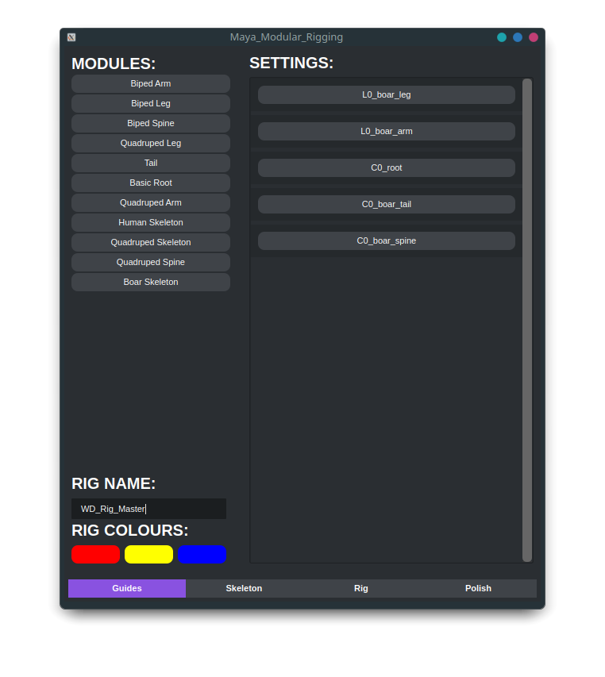

<h1 align="center">Modular-Auto-Rigging aka MOD</h1>
<p align="center">
    
    
    
</p>
<div align="center">
    
</div>

### Running The Tool

> [!WARNING]
> - All tools are designed to be either run through the Maya script editor or a shelf tool and can be ran with a similar code to the below.<br>
> - See each individual sub-folder for the specific run code.<br>
> - As I have switched to linux recently you might need to check the pathing if you are running a windows based machine.

```python
import maya_modular_rigging
```
### New Module Setup & Parameters

> [!IMPORTANT]
> New modules must be placed within their own .py file within [~/mod/systems/modules](https://github.com/WillDyer/maya_modular_rigging/tree/main/mod/systems/modules)

| Parameter           | Type        | Default     | Description|
|---------------------|-------------|-------------|------------|
| is_preset           | boolean     | False       | Adds module to preset pool and hides it to the UI |
| hide                | boolean     | False       | Hide a module to the UI |
| ignore_transforms   | boolean     | True        | Ignores matching a new module to that of whats just been created |
| system              | list        | none        | List of guide names, has to be in order |
| system_pos          | dictionary  | none        | Dictionary that includes the name as the key and a value that is a list with the XYZ world space location |
| system_pos          | dictionary  | none        | Dictionary that includes the name as the key and a value that is a list with the XYZ world space rotation |
| ik_joints           | dictionary  | none        | Dictionary that includes 'start_joint', 'end_joint', 'pv_joint', 'hock', world_orientation'(bool), 'ik_type' as keys  and the values include the name of the guide that describes each item |
| side                | string      | 'L'         | Side of rig the module was made on can be custom but recommended use is 'L' or 'R' |
| space_swapping      | list        | 'root', 'cog', 'Custom' | list of items that are available space swapping locations |
| guide_scale         | float       | 1           | scale of the guide for display purposes |
| available_rig_types | list        | 'FK'        | Systems that are available to create on the module |
| reverse_foot        | boolean     | False       | Boolean option to create reverse foot system on a module |
| rev_locators        | dictionary  | none        | Dictionary that includes 'foot_ctrl', 'ankle', 'ball', 'toe', 'heel', 'bank_in', 'bank_out', first 4 items must be guides from the system |
| twist_joints        | dictionary  | none        | Dictionary that includes 'start' & 'end' which values are a string with the name of the guide |
| default_ctrl_shape  | dictionary  | none        | includes the key as 'rigtype_guidename' example ik_ankle, available shapes are 'cube', 'circle', 'locator' |

